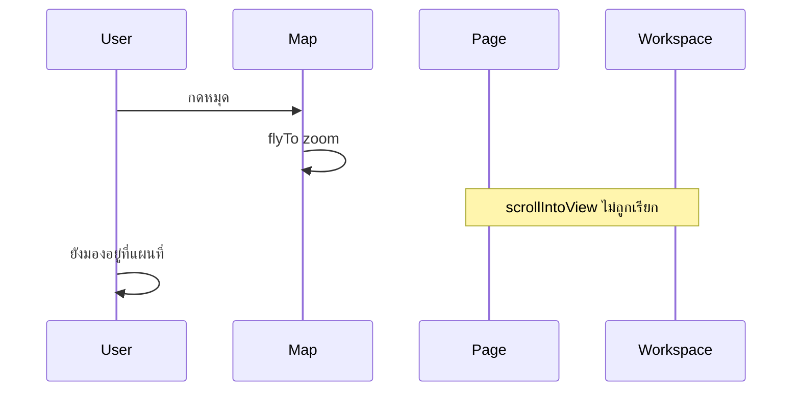
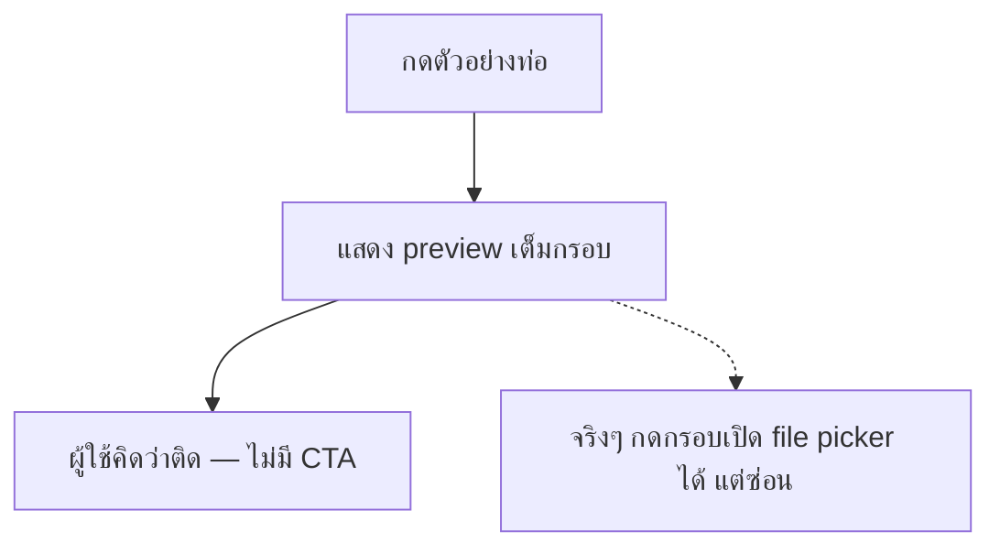
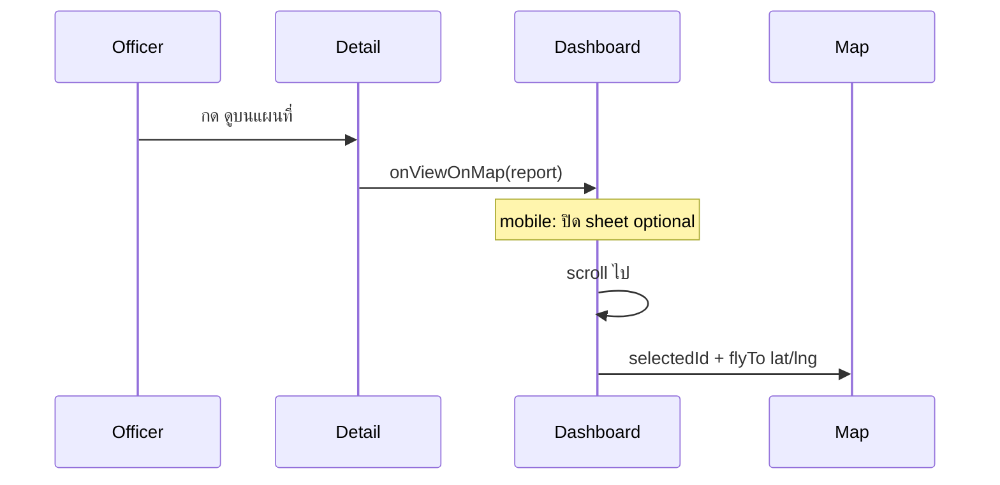

# Dashboard & Report UX — Implementation Plan

> **Master roadmap (ลำดับ Phase ล่าสุด):** [`2026-07-06-faotor-ux-master-roadmap.md`](./2026-07-06-faotor-ux-master-roadmap.md) — ใช้ไฟล์นั้นเป็นหลักสำหรับลำดับทำงาน

> **For agentic workers:** REQUIRED SUB-SKILL: Use superpowers:subagent-driven-development or superpowers:executing-plans. Design spec: [`Docs/superpowers/specs/2026-07-06-dashboard-list-workspace-ux-design.md`](../specs/2026-07-06-dashboard-list-workspace-ux-design.md)

**Goal:** (A) List อ่านง่าย (B) Report upload (C) Map → detail scroll (D) **Detail sheet เลื่อนได้ + คะแนน/AI ชัด + ดูจุดบนแผนที่**

**Architecture:** รีแฟคเตอร์ `ReportCard` + `ListWorkspaceHeader` สำหรับ dashboard; รีดีไซน์ `PhotoUploadZone` แยก CTA อัปโหลดออกจาก preview + ติดตาม `previewSource` ใน `UploadForm`

**Tech Stack:** Next.js 15, Tailwind, existing `SAMPLE_IMAGES` / `mock-analyze`

## Global Constraints

- KARO bento: `rounded-[20px]`, ส้ม = ความเสี่ยง
- ห้าม chart library
- Reporter flow: รูป + แผนที่ → วิเคราะห์ (mock)
- TH/EN ผ่าน `lib/locales/*.json`

---

# Part A — Dashboard List Workspace

## Root Cause — ReportCard

[`components/dashboard/ReportCard.tsx`](../../components/dashboard/ReportCard.tsx) ใช้ `flex-1` คั่นระหว่างข้อความกับ `ScoreRing` → ช่องว่างกลางการ์ด

## Phase 1 — ReportCard v2

**ไฟล์:** [`components/dashboard/ReportCard.tsx`](../../components/dashboard/ReportCard.tsx)

- แถวชื่อ: `justify-between` → (ชื่อ+เขต) | `ScoreRing size={40}`
- Meta: badges + urgency + เวลา + chevron เมื่อ selected
- Thumbnail `72px` + `ring-2` ตามความเสี่ยง

**ไฟล์:** [`components/ui/ScoreRing.tsx`](../../components/ui/ScoreRing.tsx) — `className?` prop

**Locales:** `dashboard.cardUrgent`

## Phase 2 — ListWorkspaceHeader

**สร้าง:** [`components/dashboard/ListWorkspaceHeader.tsx`](../../components/dashboard/ListWorkspaceHeader.tsx)

**แก้:** [`app/dashboard/page.tsx`](../../app/dashboard/page.tsx)

## Phase 3 — Filter & Polish

[`FilterTabs.tsx`](../../components/dashboard/FilterTabs.tsx) — severe tab ส้ม  
[`DashboardToolbar.tsx`](../../components/dashboard/DashboardToolbar.tsx) — spacing

---

# Part C — แผนที่ → รายละเอียด (Map pin scroll)

## Root Cause (บั๊กในโค้ด)

ใน [`app/dashboard/page.tsx`](../../app/dashboard/page.tsx) `useEffect` เลื่อนหน้าเฉพาะเมื่อเลือกจาก **คิว** ไม่ใช่ **แผนที่**:

```145:158:app/dashboard/page.tsx
if (selectSource === "map" || selectSource === "queue") {
  // scroll ภายใน list container เท่านั้น
  if (selectSource === "queue") {   // ← map ไม่เข้าเงื่อนไขนี้!
    workspaceRef.current?.scrollIntoView(...);
  }
}
```

เมื่อกดหมุด: `LeafletMap` **flyTo** ซูมเข้า (ทำงาน) แต่ workspace อยู่**ใต้**แผนที่ที่สูง `lg:h-[min(72vh,640px)]` → ผู้ใช้ไม่เห็น list/detail



## แนวทางที่พิจารณา

| # | แนวทาง | ข้อดี | ข้อเสีย |
|---|--------|-------|---------|
| A | **แก้ scroll + ลดความสูงแผนที่** (แนะนำ) | แก้ตรงจุด, เปลี่ยนน้อย | แผนที่เล็กลงเล็กน้อย |
| B | ย้าย workspace ขึ้นเหนือแผนที่ | เห็น detail เร็ว | สลับ layout ใหญ่ |
| C | Popover รายละเอียดบนแผนที่ | ไม่ต้อง scroll | ซ้ำกับ detail panel |

**เลือก A** — bug fix + layout ปรับเล็กน้อย + affordance ชัด

## Phase 3b — Map pin → Workspace scroll

**ไฟล์:** [`app/dashboard/page.tsx`](../../app/dashboard/page.tsx)

1. **เรียก `workspaceRef.scrollIntoView`** เมื่อ `selectSource === "map"` เหมือน queue
2. **หน่วง ~500ms** หลังเลือก (รอ `flyTo` 0.45s ใน LeafletMap) แล้วค่อย scroll — ลดการชนกันของ animation
3. รวม logic scroll เป็น helper `scrollToReportSelection(source)` — map และ queue ใช้ร่วมกัน
4. **Mobile (`xl` ลง):** หลังเลือกจาก map เปิด `DetailSheet` อยู่แล้ว — อาจไม่ต้อง scroll มาก แต่ยัง scroll workspace เพื่อ highlight การ์ดใน list

**ไฟล์:** [`components/dashboard/MapPreviewCard.tsx`](../../components/dashboard/MapPreviewCard.tsx)

5. ลดความสูงแผนที่: `lg:h-[min(72vh,640px)]` → **`lg:h-[min(42vh,400px)]`** (หรือ `400px` คงที่) — ให้เห็น workspace ใกล้ขึ้นโดยไม่ scroll ไกล
6. เมื่อ `selectedId` มีค่า: แสดงแถบใต้หัวข้อแผนที่ — ชื่อจุด + ลิงก์ `dashboard.mapViewDetail` → scroll workspace (backup ถ้า user ไม่ scroll อัตโนมัติ)

**Locales:**

| Key | TH |
|-----|-----|
| `dashboard.mapViewDetail` | ดูรายละเอียดด้านล่าง |
| `dashboard.mapSelectedHint` | เลือก {location} — เลื่อนลงเพื่อดูรายละเอียด |

**Optional polish:** [`LeafletMap.tsx`](../../components/dashboard/LeafletMap.tsx) — ลด zoom สูงสุด flyTo เป็น 13 ถ้าซูมแรงเกินไป (ไม่บังคับ)

## Phase 5 — Docs & QA (อัปเดต)

เพิ่มใน [`Docs/UI_UX_SPEC.md`](../../Docs/UI_UX_SPEC.md):

- § Map pin selection — ต้อง scroll ไป `#report-workspace` เสมอ
- § Map card height — ไม่เกิน ~400px บน desktop เพื่อไม่บัง workspace

**ทดสอบเพิ่ม:**

| # | Scenario |
|---|----------|
| 6 | Desktop: กดหมุด → หน้าเลื่อนลง workspace + การ์ดถูก highlight + detail ขวา |
| 7 | กดหมุดคนละจุดติดกัน → scroll ยังทำงาน |
| 8 | เลือกจาก list → หน้าไม่กระโดด (ไม่ scroll ทั้งหน้า) |

---

# Part B — Report Photo Upload (ตัวอย่างท่อ → อัปโหลดได้)

## Root Cause

```34:36:components/report/PhotoUploadZone.tsx
{preview ? (
     // ไม่มี hint / ปุ่ม — ดูเหมือน static
) : ( ... กล้อง + photoHint ... )}
```

กดตัวอย่าง → `setPreview(sampleUrl)` → UI ไม่บอกว่าจะอัปโหลดรูปจริงยังไง



## Phase 4 — PhotoUploadZone v2

**ไฟล์:** [`components/report/PhotoUploadZone.tsx`](../../components/report/PhotoUploadZone.tsx)

- Props เพิ่ม: `previewSource?: 'none' | 'file' | 'sample'`
- **ปุ่มหลักเสมอ** ใต้กรอบ preview: `report.uploadPhoto` → `onSelect()`
- เมื่อ `preview`: overlay บนรูป (gradient + ไอคอนกล้อง + `report.changePhoto`) — กดกรอบก็ได้เหมือนเดิม
- Badge `report.sampleBadge` มุมบนซ้ายเมื่อ `previewSource === 'sample'`
- Section ตัวอย่าง: หัวข้อ `report.sampleSection` + ปุ่มตัวอย่างแบบ pill เล็ก (ไม่แข่งกับปุ่มอัปโหลด)

**ไฟล์:** [`components/UploadForm.tsx`](../../components/UploadForm.tsx)

- State `previewSource` — อัปเดตใน `handleFileChange` → `'file'`, ใน `onSampleSelect` → `'sample'`, reset → `'none'`
- ส่ง `previewSource` ลง `PhotoUploadZone`
- เมื่อเลือก sample: `fileRef.current.value = ''` (ให้เลือกไฟล์เดิมซ้ำได้)

**Locales** (`th.json` / `en.json`):

| Key | TH |
|-----|-----|
| `report.uploadPhoto` | ถ่ายรูป / เลือกจากเครื่อง |
| `report.changePhoto` | แตะเพื่อเปลี่ยนรูป |
| `report.sampleSection` | ลองดูตัวอย่าง (ไม่บังคับ) |
| `report.sampleBadge` | ตัวอย่าง demo |

## Phase 5 — Docs & QA

**ไฟล์:** [`Docs/UI_UX_SPEC.md`](../../Docs/UI_UX_SPEC.md)

- § Report list card layout
- § Report photo step — ต้องมี CTA อัปโหลดเสมอ; ตัวอย่าง ≠ แทนที่การอัปโหลด

**ทดสอบ:**

| # | Scenario |
|---|----------|
| 1 | กดตัวอย่าง → เห็น badge demo + ปุ่มอัปโหลด |
| 2 | กดปุ่มอัปโหลด → file picker เปิด |
| 3 | อัปโหลดรูปจริง → badge demo หาย, preview เปลี่ยน |
| 4 | Dashboard list — ชื่อชิดคะแนน |
| 5 | กดหมุดแผนที่ → scroll ลง workspace + detail |
| 6 | `npm run build` |

---

**Goal:** (A) List อ่านง่าย (B) Report upload (C) Map → detail scroll (D) **Detail sheet เลื่อนได้ + คะแนน/AI ชัด + ดูจุดบนแผนที่**

---

# Part D — รายละเอียดรายงาน (Detail Sheet / Panel)

## ปัญหา 1: เปิด detail แล้วเลื่อนอะไรไม่ได้

**อาการ:** กดดูรายงาน (mobile/tablet `<xl`) → modal เปิด → scroll ไม่ได้จนกว่าจะปิด

**สาเหตุในโค้ด** [`DetailSheet.tsx`](../../components/DetailSheet.tsx):

```23:29:components/DetailSheet.tsx
document.body.style.overflow = "hidden";  // ล็อกพื้นหลัง — ถูกต้อง
```

```40:54:components/DetailSheet.tsx
<div className="fixed inset-0 ... flex items-end">
  <div className="... max-h-[92vh] overflow-y-auto ...">
    <div className="p-6">
      <ReportDetailContent />  // เนื้อหายาวเกินจอ
```

- `body` ถูกล็อก (ปกติของ modal) แต่ **scroll ภายใน sheet ไม่ทำงาน** บนบาง viewport เพราะโครง flex + ไม่มี `min-h-0` / แยก scroll region
- `DetailSheet` **ไม่ส่ง `onClose`** ให้ `ReportDetailContent` → ไม่มีปุ่ม X ในเนื้อหา (ปิดได้แค่กดพื้นหลัง)
- ปุ่มบันทึกอยู่ล่างสุดของเนื้อหา — ถ้า scroll ไม่ได้จะกดไม่ถึง

### แก้ไข (Phase 6a — DetailSheet scroll)

**ไฟล์:** [`components/DetailSheet.tsx`](../../components/DetailSheet.tsx)

โครงใหม่:

```
┌─ fixed overlay ─────────────────┐
│ ┌─ sheet max-h-[92dvh] flex col ─┐
│ │ [drag handle]                   │
│ │ ┌─ flex-1 min-h-0 overflow-y-auto ─┐
│ │ │  ReportDetailContent (scroll)      │
│ │ └────────────────────────────────────┘
│ │ ┌─ sticky footer ──────────────────┐
│ │ │  [บันทึก]                         │  ← หรือปุ่มอยู่ใน content
│ │ └──────────────────────────────────┘
│ └─────────────────────────────────┘
└─────────────────────────────────┘
```

- แยก **scroll body** กับ **header handle** (`rounded-full` bar บน sheet)
- `max-h-[min(92dvh,92vh)]` + `overscroll-contain` + `touch-pan-y`
- ส่ง `onClose` → `ReportDetailContent` (แสดงปุ่ม X)
- Desktop panel [`ReportDetailPanel`](../../components/dashboard/ReportDetailPanel.tsx): เพิ่ม `max-h-[calc(100vh-6rem)] overflow-y-auto` กลับมาเมื่อเนื้อหายาว (xl layout)

---

## ปัญหา 2: คะแนน + AI อ่านยาก ไม่เด่น

**ปัจจุบัน** [`ReportDetailContent.tsx`](../../components/ReportDetailContent.tsx):
- คะแนน 2 วงใน grid แคบ — label เล็ก (`12px`) แยกจากตัวเลข
- AI เป็นกล่องฟ้าธรรมดา ข้อความ `14px` ไม่ต่างจาก body

### แก้ไข (Phase 6b — Metrics + AI redesign)

**สร้าง:** [`components/report/DetailMetricCards.tsx`](../../components/report/DetailMetricCards.tsx) (optional extract)

| ส่วน | ใหม่ |
|------|------|
| **ความเสี่ยง** | การ์ดเต็มความกว้างบน mobile / 2 คอลัมน์ desktop — ตัวเลขใหญ่ `text-[32px]` + ring 96px + RiskBadge ใต้ label ชัด |
| **ความเร่งด่วน** | คู่กัน — แสดงฝนเป็น chip แยก ไม่ยัดใต้ ring |
| **AI** | การ์ด `border-l-4 border-brand-blue` + ไอคอน sparkle + หัวข้อ `text-[15px] font-bold` + เนื้อหา `text-[15px] leading-relaxed` พื้น `bg-gradient-to-br from-brand-blue-soft to-white` |

**Mobile (`compact` / sheet):** stack metrics แนวตั้งแทน 2 คอลัมน์แคบ — อ่านง่ายกว่า

---

## คำถาม: ควรมีปุ่ม "ดูบนแผนที่" ไหม? อยู่ตรงไหน?

### คำตอบ: **ควรมี** — สำคัญสำหรับเจ้าหน้าที่

| เหตุผล | รายละเอียด |
|--------|-------------|
| ยืนยันตำแหน่ง | ก่อนออกไปลอกท่อ ต้องรู้ว่าจุดอยู่ตรงไหน |
| ปิด loop map ↔ detail | ตอนนี้ map → detail มี แต่ detail → map ยังไม่มี |
| mock pitch | แสดงว่าระบบ "ครบวงจร" ไม่ใช่แค่ list |

### วางที่ไหน (แนะนำ)

| ตำแหน่ง | ความสำคัญ | พฤติกรรม |
|---------|-----------|----------|
| **1. ReportDetailContent** ใต้ chips เขต/เวลา/สถานะ | **หลัก (แนะนำ)** | ปุ่ม `outline` + ไอคอนหมุด `ดูบนแผนที่` |
| 2. Mini map ใน detail (read-only ~160px) | เสริม (mock wow) | แสดง pin เดียวทันที ไม่ต้อง scroll |
| 3. ReportCard ใน list | รอง | ไอคอนเล็ก — ทำรอบหลังได้ |

**ไม่แนะนำ:** ใส่ใน KPI / calendar / queue — ไม่เกี่ยวกับจุดเดียว

### Flow เมื่อกด "ดูบนแผนที่"



**ไฟล์:**

- [`ReportDetailContent.tsx`](../../components/ReportDetailContent.tsx) — ปุ่ม + optional `DetailMiniMap`
- [`app/dashboard/page.tsx`](../../app/dashboard/page.tsx) — `handleViewOnMap`: ปิด sheet (mobile), scroll ไป map anchor, `setSelected(report)`
- [`MapPreviewCard.tsx`](../../components/dashboard/MapPreviewCard.tsx) — `id="dashboard-map"` anchor
- **สร้าง:** [`components/report/DetailMiniMap.tsx`](../../components/report/DetailMiniMap.tsx) — Leaflet แบบ static, 1 marker, ไม่ zoom มาก

**Locales:** `detail.viewOnMap` = "ดูบนแผนที่" / "View on map"

---

## Phase 6 — สรุปไฟล์ Part D

| ไฟล์ | การเปลี่ยนแปลง |
|------|----------------|
| `DetailSheet.tsx` | scroll region + handle + onClose |
| `ReportDetailPanel.tsx` | overflow scroll เมื่อสูงเกินจอ |
| `ReportDetailContent.tsx` | metrics layout, AI card, ปุ่มดูแผนที่ |
| `DetailMetricCards.tsx` | (ใหม่) คะแนน 2 ชุด |
| `DetailMiniMap.tsx` | (ใหม่) แผนที่ย่อใน detail |
| `dashboard/page.tsx` | `handleViewOnMap` |
| `MapPreviewCard.tsx` | anchor id |
| locales | `detail.viewOnMap` |

---

## Phase 5 — Docs & QA (อัปเดตเพิ่ม)

| # | Scenario |
|---|----------|
| 9 | เปิด detail บน mobile → **เลื่อนดู AI + กดบันทึกได้** |
| 10 | กดดูบนแผนที่ → scroll ไปแผนที่ + หมุดซูมถูกจุด |
| 11 | คะแนน + AI อ่านง่ายบนจอเล็ก |

---

## ไม่แตะ

KPI, calendar, `mock-analyze` logic, ขั้นวิเคราะห์/ผลลัพธ์หน้า report

## ลำดับทำ (อัปเดต)

1. **Phase 6a** — DetailSheet scroll (ติดขัดที่ user เจอตอนนี้)
2. **Phase 6b + view on map** — metrics/AI + ปุ่มแผนที่
3. Phase 3b — map pin scroll
4. Phase 4 — report upload
5. Phase 1–3 — dashboard list
6. Phase 5 — docs + verify รวม
