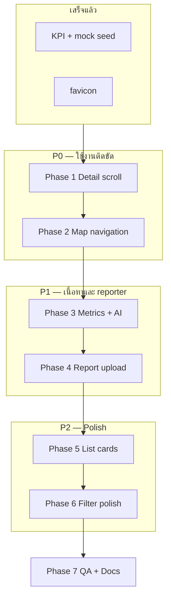

# FaoTor UX Master Roadmap — Implementation Plan

> **For agentic workers:** REQUIRED SUB-SKILL: Use `superpowers:executing-plans` or `superpowers:subagent-driven-development` ทีละ Phase. ออกแบบละเอียด: [`2026-07-06-dashboard-list-workspace-ux-design.md`](../specs/2026-07-06-dashboard-list-workspace-ux-design.md)

**Goal:** ทำให้ FaoTor mock-up ใช้งานได้ลื่น อ่านง่าย ครบวงจร officer flow (แผนที่ ↔ รายการ ↔ รายละเอียด) และ reporter flow (อัปโหลดรูป)

**Architecture:** แก้บั๊ก interaction ก่อน (scroll/navigation) → ปรับเนื้อหา detail → ปรับ list/report UI → docs/QA ท้าย

**Tech Stack:** Next.js 15 · Tailwind KARO tokens · Leaflet · localStorage mock

## Global Constraints

- สี: `brand-blue` / `brand-orange` — ส้มสำหรับความเสี่ยง ไม่แดง harsh
- ห้าม chart library (KPI ใช้ SVG mini charts เท่านั้น)
- Officer: ไม่มีปุ่ม CSV / รายงานใหม่ บน dashboard
- ทุกข้อความใหม่: `lib/locales/th.json` + `en.json`
- แต่ละ Phase จบด้วย `npm run build` ผ่าน

---

## สรุปปัญหาที่พบ (Problem Inventory)

| # | ปัญหา | โซน | สาเหตุหลัก | ความเร่งด่วน |
|---|--------|-----|------------|--------------|
| P1 | เปิดรายละเอียดแล้ว**เลื่อนไม่ได้** | `DetailSheet` mobile | `body` lock + โครง flex ไม่มี scroll region | **P0** |
| P2 | กดหมุดแผนที่ **ไม่เลื่อนลง** ดู detail | `dashboard/page.tsx` | `scrollIntoView` เฉพาะ queue ไม่รวม map | **P0** |
| P3 | ไม่มีทาง **detail → แผนที่** | `ReportDetailContent` | ยังไม่มีปุ่ม / handler | **P0** |
| P4 | คะแนน 2 วง + AI **อ่านยาก** | `ReportDetailContent` | grid แคบ, typography ไม่เด่น | P1 |
| P5 | กดตัวอย่างท่อแล้ว **อัปโหลดรูปจริงไม่รู้ทาง** | `PhotoUploadZone` | preview ซ่อน CTA | P1 |
| P6 | ชื่อรายงาน **ห่างจากคะแนน** | `ReportCard` | `flex-1` สร้าง dead zone | P2 |
| P7 | หัวข้อ list **ไม่เด่น** | dashboard workspace | ไม่มี header chrome | P2 |
| P8 | KPI trend **+100% ทุกใบ** | mock seed | seed อยู่ใน 7 วันเดียว | ✅ แก้แล้ว (v6) |

---

## สิ่งที่ทำเสร็จแล้ว (ไม่ต้องทำซ้ำ)

| รายการ | Commit / ไฟล์ |
|--------|----------------|
| KPI แยก series + caption | `dashboard/page.tsx`, `dashboard-analytics.ts` |
| Mock seed 14 วัน + trend เนียน | `mock-data.ts`, storage v6 |
| โทนสีส้ม risk | `lib/risk-colors.ts` |
| Workspace scroll/list/detail layout พื้นฐาน | commits ก่อนหน้า |
| Favicon โลโก้ | `app/layout.tsx` |

---

## Phase Overview (ลำดับทำ)



| Phase | ชื่อ | เป้าหมาย | ไฟล์หลัก | ทดสอบผ่านเมื่อ |
|-------|------|----------|----------|----------------|
| **1** | Detail Scroll Fix | เลื่อนใน sheet ได้ + ปิดง่าย | `DetailSheet.tsx`, `ReportDetailPanel.tsx` | mobile: scroll ถึงปุ่มบันทึก |
| **2** | Map ↔ Detail | ปิด loop แผนที่สองทาง | `page.tsx`, `MapPreviewCard.tsx`, `ReportDetailContent.tsx` | กดหมุด→ลง detail; กดดูแผนที่→ซูม |
| **3** | Metrics + AI | คะแนน/AI อ่านง่ายเด่น | `ReportDetailContent.tsx`, `DetailMetricCards.tsx` | อ่านคะแนน+AI ใน 3 วินาที |
| **4** | Report Upload | ตัวอย่าง ≠ ติด | `PhotoUploadZone.tsx`, `UploadForm.tsx` | อัปโหลดหลังดูตัวอย่างได้ |
| **5** | List Workspace | การ์ด + header | `ReportCard.tsx`, `ListWorkspaceHeader.tsx` | ชื่อชิดคะแนน |
| **6** | Visual Polish | filter ส้ม, spacing | `FilterTabs.tsx`, `DashboardToolbar.tsx` | severe tab ส้ม |
| **7** | QA & Docs | spec + build | `UI_UX_SPEC.md` | `npm run build` + checklist ครบ |

---

## Phase 1 — Detail Scroll Fix (P0)

**ทำไมก่อน:** ผู้ใช้ติดใน modal ไม่สามารถใช้งานต่อได้

### งาน

- [ ] รีโครง `DetailSheet`: `flex flex-col` + scroll region `flex-1 min-h-0 overflow-y-auto`
- [ ] เพิ่ม drag handle + ส่ง `onClose` → `ReportDetailContent` (ปุ่ม X)
- [ ] `max-h-[min(92dvh,92vh)]` + `overscroll-contain`
- [ ] `ReportDetailPanel`: `max-h-[calc(100vh-6rem)] overflow-y-auto` บน desktop

### ไฟล์

- `components/DetailSheet.tsx`
- `components/dashboard/ReportDetailPanel.tsx`

### ตรวจ

1. เปิดรายงานบน viewport `<1280px` → เลื่อนดู AI และกดบันทึกได้
2. ปิดด้วย X และกดพื้นหลังได้

---

## Phase 2 — Map ↔ Detail Navigation (P0)

**ทำไมต่อจาก Phase 1:** หลัง detail ใช้ได้แล้ว ต้องเชื่อมแผนที่สองทาง

### งาน

- [ ] **Map → detail:** `selectSource === "map"` → `workspaceRef.scrollIntoView` (เหมือน queue) + delay ~500ms หลัง flyTo
- [ ] Helper `scrollToReportSelection(source)` ใน `page.tsx`
- [ ] ลดความสูงแผนที่: `72vh` → `~400px` / `42vh`
- [ ] แถบ hint เมื่อเลือกจุด: `dashboard.mapSelectedHint`
- [ ] **Detail → map:** ปุ่ม `detail.viewOnMap` ใน `ReportDetailContent`
- [ ] `handleViewOnMap` → scroll `#dashboard-map` + `setSelected` + flyTo
- [ ] (Optional) `DetailMiniMap.tsx` ~160px ใต้รูปใน detail

### ไฟล์

- `app/dashboard/page.tsx`
- `components/dashboard/MapPreviewCard.tsx`
- `components/ReportDetailContent.tsx`
- `components/report/DetailMiniMap.tsx` (ใหม่, optional)

### ตรวจ

1. กดหมุด → หน้าเลื่อนลง workspace + detail แสดง
2. ใน detail กดดูบนแผนที่ → scroll ขึ้นแผนที่ + หมุดถูกจุด
3. เลือกจาก list โดยตรง → หน้าไม่กระโดด

---

## Phase 3 — Metrics + AI Redesign (P1)

**ทำไมหลัง Phase 2:** เนื้อหา detail ต้องอ่านได้หลัง scroll ทำงาน

### งาน

- [ ] สร้าง `DetailMetricCards` — ring ใหญ่ขึ้น, label ชัด, rain chip แยก
- [ ] Mobile/sheet: stack แนวตั้ง แทน grid 2 คอลัมน์แคบ
- [ ] AI card: `border-l-4`, gradient, หัวข้อ bold, เนื้อหา 15px

### ไฟล์

- `components/report/DetailMetricCards.tsx` (ใหม่)
- `components/ReportDetailContent.tsx`

### ตรวจ

1. คะแนนความเสี่ยง + เร่งด่วน แยกอ่านชัด
2. AI โดดเด่นกว่า body text ทั่วไป

---

## Phase 4 — Report Photo Upload (P1)

**ทำไมแยก Phase:** คนละหน้า (`/report`) ไม่ block dashboard

### งาน

- [ ] `previewSource`: `'none' | 'file' | 'sample'`
- [ ] ปุ่มอัปโหลดเสมอ + overlay เปลี่ยนรูป + badge demo
- [ ] Section `ลองดูตัวอย่าง (ไม่บังคับ)`

### ไฟล์

- `components/report/PhotoUploadZone.tsx`
- `components/UploadForm.tsx`
- locales: `report.uploadPhoto`, `changePhoto`, `sampleSection`, `sampleBadge`

### ตรวจ

1. กดตัวอย่าง → เห็น badge + ปุ่มอัปโหลด
2. อัปโหลดรูปจริงแทนได้

---

## Phase 5 — List Workspace (P2)

### งาน

- [ ] `ReportCard` title-band: ชื่อ | ScoreRing แถวเดียวกัน
- [ ] urgency chip, thumbnail ring, chevron เมื่อ selected
- [ ] `ListWorkspaceHeader` — หัวข้อเด่น + รวม toolbar/filter

### ไฟล์

- `components/dashboard/ReportCard.tsx`
- `components/dashboard/ListWorkspaceHeader.tsx`
- `components/ui/ScoreRing.tsx` (`className` prop)
- `app/dashboard/page.tsx`

### ตรวจ

1. ไม่มีช่องว่างระหว่างชื่อกับคะแนน
2. หัวข้อ "รายการรายงาน" เด่นขึ้น

---

## Phase 6 — Visual Polish (P2)

### งาน

- [ ] `FilterTabs`: severe active = `brand-orange`
- [ ] `DashboardToolbar`: ลด margin ซ้ำใน header wrapper

### ตรวจ

1. Tab อุดตันหนัก active เป็นส้ม

---

## Phase 7 — QA, Docs & Release

### งาน

- [ ] อัปเดต `Docs/UI_UX_SPEC.md` — ทุกกฎใหม่ (detail scroll, map flow, list card, report upload)
- [ ] Smoke test checklist 11 รายการ (รวมใน design spec)
- [ ] `npm run build`
- [ ] Commit + push (เมื่อ user ขอ)

### Checklist รวม

| # | Scenario |
|---|----------|
| 1 | Detail mobile scroll + บันทึก |
| 2 | Map pin → workspace |
| 3 | Detail → ดูบนแผนที่ |
| 4 | Metrics + AI อ่านง่าย |
| 5 | Report ตัวอย่าง → อัปโหลด |
| 6 | List ชื่อชิดคะแนน |
| 7 | KPI trend ไม่ซ้ำ +100% |
| 8 | List เลือกไม่กระโดดทั้งหน้า |
| 9 | `npm run build` |

---

## Dependency Graph (ไฟล์ที่แตะบ่อย)

```
app/dashboard/page.tsx          ← Phase 2, 5
components/DetailSheet.tsx        ← Phase 1
components/ReportDetailContent.tsx ← Phase 2, 3
components/dashboard/ReportCard.tsx ← Phase 5
components/report/PhotoUploadZone.tsx ← Phase 4
Docs/UI_UX_SPEC.md              ← Phase 7
```

**หลีกเลี่ยง:** แก้ `ReportDetailContent` ใน Phase 1 และ 3 พร้อมกัน — ทำ scroll ก่อน แล้วค่อย metrics

---

## แนวทาง Execute

**Option A — Inline (แนะนำ):** ทำทีละ Phase ใน session เดียว รายงานหลังแต่ละ Phase

**Option B — Subagent:** แต่ละ Phase ส่ง subagent แยก + review กลาง

เริ่มที่ **Phase 1** เสมอ — unblock การใช้งาน mobile ก่อน

---

## เอกสารอ้างอิง

- Design spec: [`Docs/superpowers/specs/2026-07-06-dashboard-list-workspace-ux-design.md`](../specs/2026-07-06-dashboard-list-workspace-ux-design.md)
- แผนรายละเอียด (legacy parts): [`2026-07-06-dashboard-list-workspace-ux.md`](./2026-07-06-dashboard-list-workspace-ux.md)
- Mock scope: [`Docs/MOCKUP_SCOPE.md`](../../MOCKUP_SCOPE.md)
